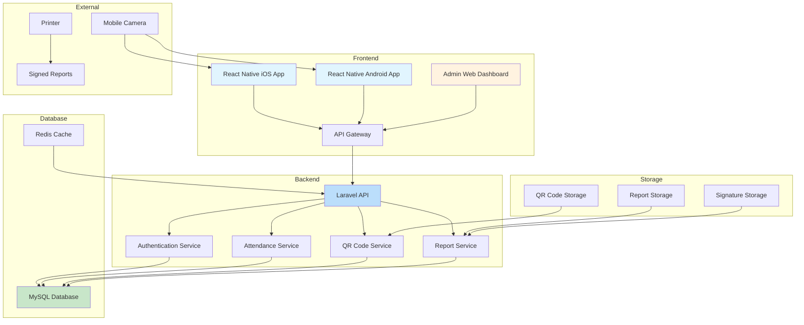
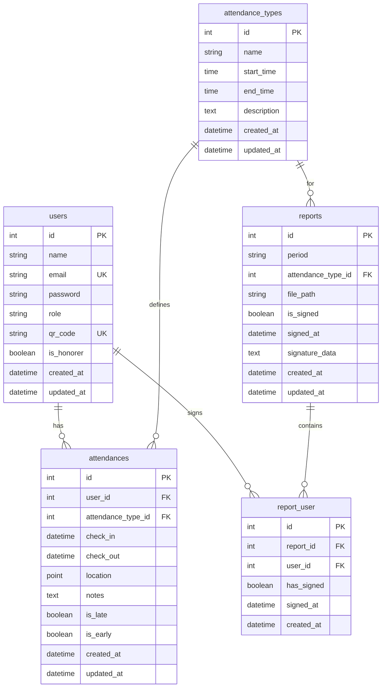
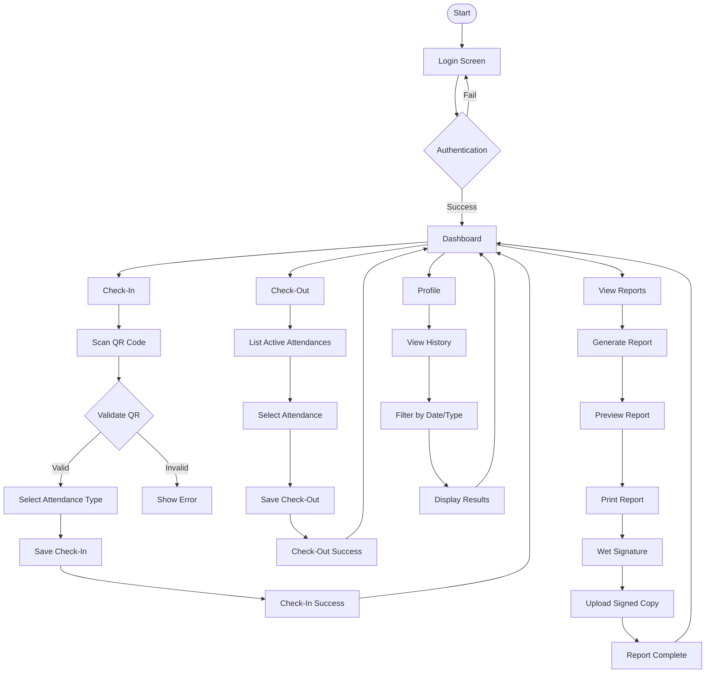
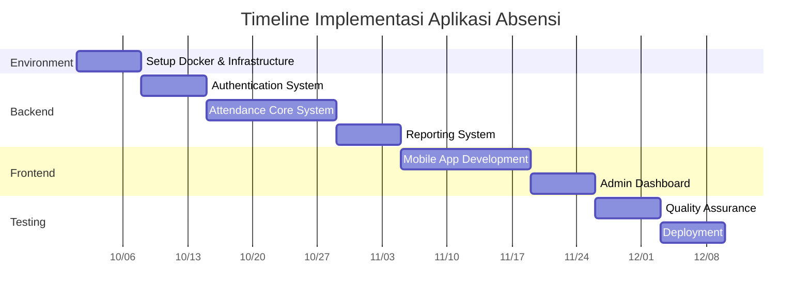

# 🏗️ **1. Desain Arsitektur Sistem**



## 🗄️ **2. ERD Optimized**



## 🔄 **3. Flowchart Aplikasi**



## 📋 **4. Rencana Implementasi & Checklist**

### **FASE 0: SETUP ENVIRONMENT (Minggu 1)**

``` Struktur Folder Lengkap

attendance-qr-system/
│
├── 📁 backend/                 # Laravel Backend
│   ├── 📁 app/
│   │   ├── 📁 Console/
│   │   ├── 📁 Exceptions/
│   │   ├── 📁 Http/
│   │   │   ├── 📁 Controllers/
│   │   │   │   ├── 📁 Auth/
│   │   │   │   ├── 📁 Attendance/
│   │   │   │   ├── 📁 Employee/
│   │   │   │   ├── 📁 Report/
│   │   │   │   └── 📁 API/
│   │   │   ├── 📁 Middleware/
│   │   │   └── 📁 Requests/
│   │   ├── 📁 Models/
│   │   ├── 📁 Providers/
│   │   └── 📁 Services/
│   │       ├── QrCodeService.php
│   │       ├── AttendanceService.php
│   │       └── ReportService.php
│   ├── 📁 bootstrap/
│   ├── 📁 config/
│   ├── 📁 database/
│   │   ├── 📁 migrations/
│   │   ├── 📁 seeders/
│   │   └── 📁 factories/
│   ├── 📁 public/
│   │   ├── 📁 qr-codes/        # Generated QR codes
│   │   ├── 📁 reports/         # Generated reports
│   │   ├── 📁 signatures/      # Scanned signatures
│   │   └── index.php
│   ├── 📁 resources/
│   │   ├── 📁 views/
│   │   ├── 📁 js/
│   │   ├── 📁 sass/
│   │   └── 📁 lang/
│   ├── 📁 routes/
│   │   ├── web.php
│   │   ├── api.php
│   │   └── console.php
│   ├── 📁 storage/
│   │   ├── 📁 app/
│   │   │   ├── 📁 public/
│   │   │   └── 📁 reports/
│   │   ├── 📁 framework/
│   │   ├── 📁 logs/
│   │   └── 📁 logs/
│   ├── 📁 tests/
│   │   ├── 📁 Unit/
│   │   ├── 📁 Feature/
│   │   └── 📁 Browser/
│   ├── 📁 vendor/
│   ├── .env
│   ├── .env.example
│   ├── artisan
│   ├── composer.json
│   └── composer.lock
│
├── 📁 frontend/                # React Native Mobile App
│   ├── 📁 assets/
│   │   ├── 📁 images/
│   │   ├── 📁 icons/
│   │   └── 📁 fonts/
│   ├── 📁 src/
│   │   ├── 📁 components/
│   │   │   ├── 📁 common/
│   │   │   ├── 📁 attendance/
│   │   │   ├── 📁 qr-scanner/
│   │   │   └── 📁 reports/
│   │   ├── 📁 screens/
│   │   │   ├── LoginScreen.js
│   │   │   ├── DashboardScreen.js
│   │   │   ├── QrScannerScreen.js
│   │   │   ├── AttendanceScreen.js
│   │   │   ├── ReportScreen.js
│   │   │   └── ProfileScreen.js
│   │   ├── 📁 services/
│   │   │   ├── api.js
│   │   │   ├── auth.js
│   │   │   └── storage.js
│   │   ├── 📁 utils/
│   │   │   ├── constants.js
│   │   │   ├── helpers.js
│   │   │   └── validators.js
│   │   ├── 📁 navigation/
│   │   │   ├── AppNavigator.js
│   │   │   └── AuthNavigator.js
│   │   ├── 📁 context/
│   │   │   ├── AuthContext.js
│   │   │   └── AttendanceContext.js
│   │   └── 📁 hooks/
│   │       ├── useAuth.js
│   │       └── useAttendance.js
│   ├── App.js
│   ├── app.json
│   ├── package.json
│   └── index.js
│
├── 📁 admin-dashboard/         # Vue.js/React Admin Dashboard (Optional)
│   ├── 📁 src/
│   │   ├── 📁 components/
│   │   ├── 📁 views/
│   │   ├── 📁 router/
│   │   └── 📁 store/
│   └── package.json
│
├── 📁 docker/                  # Docker Configuration
│   ├── 📁 nginx/
│   │   └── nginx.conf
│   ├── 📁 mysql/
│   │   └── custom.cnf
│   └── 📁 php/
│       └── php.ini
│
├── 📁 documentation/           # Dokumentasi
│   ├── API.md
│   ├── SETUP.md
│   └── USER_GUIDE.md
│
├── 📁 scripts/                 # Utility Scripts
│   ├── deploy.sh
│   ├── backup.sh
│   └── setup.sh
│
├── docker-compose.yml
├── Dockerfile
├── .dockerignore
├── .gitignore
├── README.md
└── Makefile
```

**🎯 Goal: Development environment siap**

| Checklist | Status | Prioritas |
|-----------|--------|-----------|
| [ ] | Setup project structure dengan folders | High |
| [ ] | Install Docker & Docker Compose | High |
| [ ] | Create docker-compose.yml dengan custom ports | High |
| [ ] | Create Dockerfile untuk Laravel | High |
| [ ] | Setup Nginx configuration | High |
| [ ] | Setup MySQL configuration | High |
| [ ] | Setup PHP configuration | High |
| [ ] | Initialize Laravel project di backend/ | High |
| [ ] | Initialize React Native project di frontend/ | High |
| [ ] | Test semua services running | High |

### **FASE 1: AUTHENTICATION SYSTEM (Minggu 2)**

**🎯 Goal: User management dan authentication**

| Checklist | Status | Prioritas |
|-----------|--------|-----------|
| [ ] | Create users table migration | High |
| [ ] | Implement JWT authentication | High |
| [ ] | Create login API endpoint | High |
| [ ] | Create user registration API | High |
| [ ] | Implement QR code generation untuk users | High |
| [ ] | Setup role-based access control | Medium |
| [ ] | Create admin user seeder | Medium |
| [ ] | Implement password reset | Low |

### **FASE 2: ATTENDANCE CORE (Minggu 3-4)**

**🎯 Goal: Sistem absensi functional**

| Checklist | Status | Prioritas |
|-----------|--------|-----------|
| [ ] | Create attendance_types table | High |
| [ ] | Create attendances table | High |
| [ ] | Implement check-in API | High |
| [ ] | Implement check-out API | High |
| [ ] | Create attendance validation logic | High |
| [ ] | Implement location tracking | High |
| [ ] | Add late/early detection | Medium |
| [ ] | Create attendance history API | Medium |
| [ ] | Implement real-time monitoring | Low |

### **FASE 3: MOBILE APP (Minggu 5-6)**

**🎯 Goal: Aplikasi mobile functional**

| Checklist | Status | Prioritas |
|-----------|--------|-----------|
| [ ] | Setup React Navigation | High |
| [ ] | Create login screen | High |
| [ ] | Implement QR code scanner | High |
| [ ] | Create dashboard screen | High |
| [ ] | Build check-in/check-out UI | High |
| [ ] | Create attendance history screen | Medium |
| [ ] | Implement push notifications | Medium |
| [ ] | Setup offline storage | Low |

### **FASE 4: REPORTING SYSTEM (Minggu 7)**

**🎯 Goal: Laporan dan signature workflow**

| Checklist | Status | Prioritas |
|-----------|--------|-----------|
| [ ] | Create reports table | High |
| [ ] | Implement PDF report generation | High |
| [ ] | Create report API endpoints | High |
| [ ] | Implement report filtering | Medium |
| [ ] | Create signature capture system | Medium |
| [ ] | Build report preview UI | Medium |
| [ ] | Implement bulk report generation | Low |
| [ ] | Add email report delivery | Low |

### **FASE 5: ADMIN DASHBOARD (Minggu 8)**

**🎯 Goal: Admin management interface**

| Checklist | Status | Prioritas |
|-----------|--------|-----------|
| [ ] | Create admin dashboard layout | Medium |
| [ ] | Implement user management | Medium |
| [ ] | Build attendance monitoring | Medium |
| [ ] | Create report management | Medium |
| [ ] | Add real-time statistics | Low |
| [ ] | Implement export functionality | Low |

### **FASE 6: TESTING & DEPLOYMENT (Minggu 9)**

**🎯 Goal: Siap production**

| Checklist | Status | Prioritas |
|-----------|--------|-----------|
| [ ] | Write unit tests untuk backend | High |
| [ ] | Write integration tests | High |
| [ ] | Test pada iOS device | High |
| [ ] | Test pada Android device | High |
| [ ] | Performance optimization | Medium |
| [ ] | Security audit | Medium |
| [ ] | Production deployment | Medium |
| [ ] | Create user documentation | Low |

## 🚀 **5. Timeline Estimasi**



## 🎯 **6. Prioritas Development**

### **High Priority (Minggu 1-4)**

```bash
1. Docker setup dan environment
2. JWT authentication system  
3. QR code generation dan scanning
4. Check-in/check-out functionality
5. Basic report generation
```

### **Medium Priority (Minggu 5-7)**

```bash
1. Mobile app UI/UX
2. Attendance history dan filtering
3. Report signing workflow
4. Admin user management
```

### **Low Priority (Minggu 8-9)**

```bash
1. Push notifications
2. Advanced reporting features
3. Email integrations
4. Additional export formats
```

## 📊 **7. Progress Tracking**

**Progress Overall:** 0% (Not Started)

**Next Steps:**

1. ✅ Create project structure (0%)
2. [ ] Setup Docker environment (0%)
3. [ ] Initialize Laravel backend (0%)
4. [ ] Implement authentication (0%)
